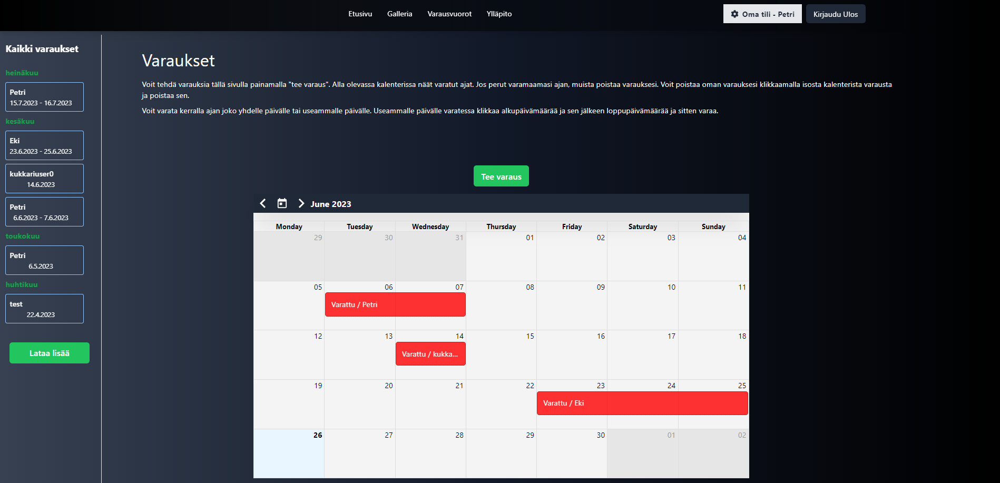

# Kukkari
Welcome to the Cabin Website project! This is a responsive React application built using Vite as a build tool, aimed at providing an online platform for my family members to reserve the cabin, write and view notes about cabin stuff and comment on them, view a gallery of photos, and more.

Project is currently in development. All text in app is in finnish because our family is from finland.


<h3>Home</h3>
<div align='center'>
  
</div>

<h3>Gallery</h3>
<div align='center'>
  
</div>

<h3>Login</h3>
<div align='center'>
  
</div>

<h3>Notes</h3>
<div align='center'>
  
</div>

<div align='center'>
  
</div>

<h3>Own Account</h3>
<div align='center'>
  
</div>

<h3>Reservations</h3>
<div align='center'>
  
</div>

<div align='center'>
  
</div>

## Features
Here are some of the features available in this application:

#### Reserve Cabin: 
Users can easily view the calendar and make reservation or cancel reservation on the cabin for a specific date range.

#### Notes: 
Users can create and view notes about anything related to the cabin. Additionally, they can also comment on notes to engage in discussions with other users. 

#### Gallery: 
Users can view a gallery of photos of the cabin, including both interior and exterior shots and also upload new images which are stored in AWS S3.

#### Own account page:
 Users can change password, see their reservations etc. And opt in for notifications if someone creates new reservation etc.

-------

Notes, Reservations and comments are updated with socket.io for real time updates.

## Getting Started
To get started with this project, follow these steps:

Clone this repository onto your local machine.

Install the required dependencies using npm or yarn:

### Run the development server:
```bash
npm install 
npm run dev
```
Open your web browser and navigate to http://localhost:5173.

### Build project
```bash
npm run build
```

## Contributing
If you would like to contribute to this project, please follow these steps:

Fork this repository onto your own GitHub account.

Clone the forked repository onto your local machine.

Create a new branch for your changes:
```bash
git checkout -b my-new-feature
```
Make your changes and commit them to your local branch.

Push your changes to your forked repository:
```bash
git push origin my-new-feature
```
Create a new pull request on the original repository, describing your changes in detail.
## License
This project is licensed under the MIT License